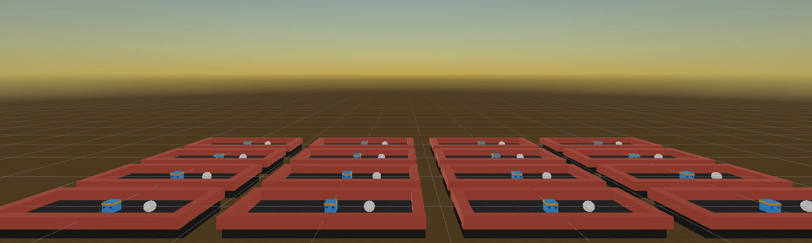
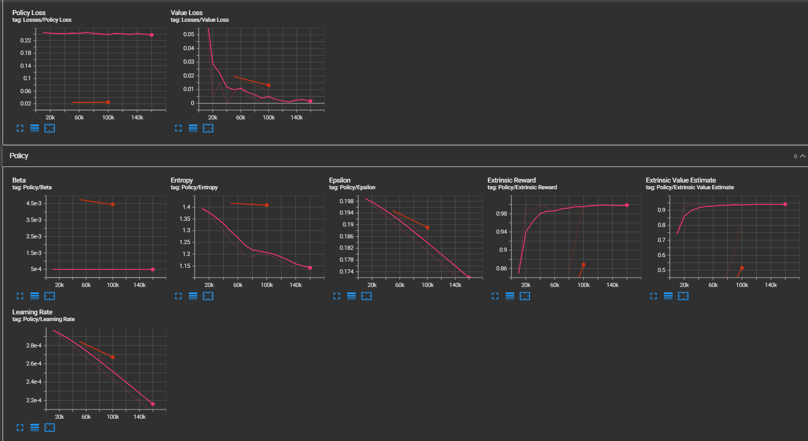

# MLAgents_Intro

#### Training a model box in Unity through MLAgents package for basic reward using Reinforcement Learning. Fun project I completed to familiarize myself with Unity and C#.

#####
Training Setup:

Stats on learning rate, total reward gained, and value loss:

